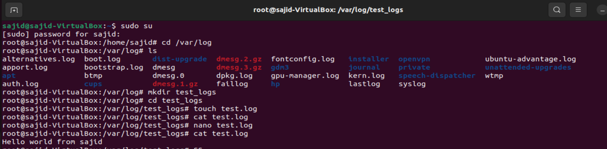
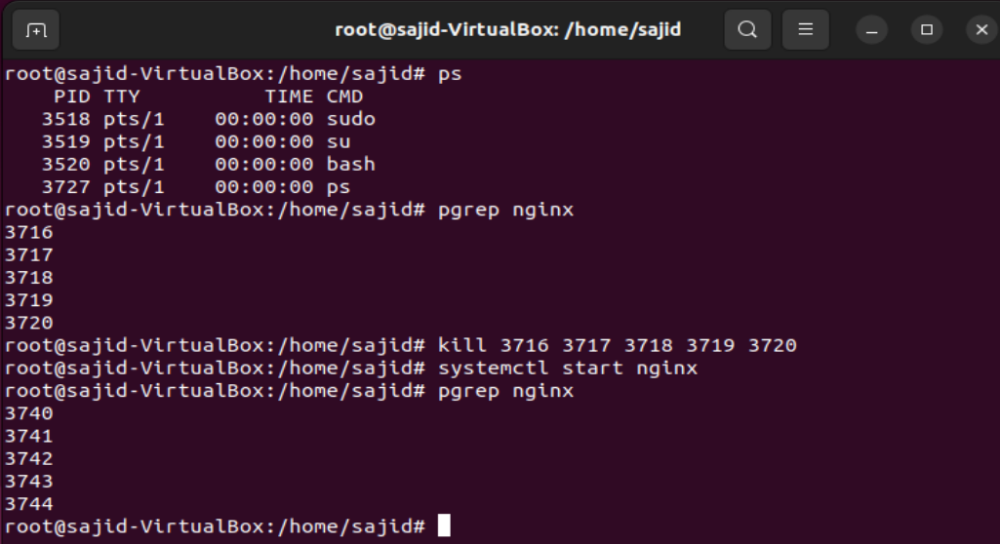
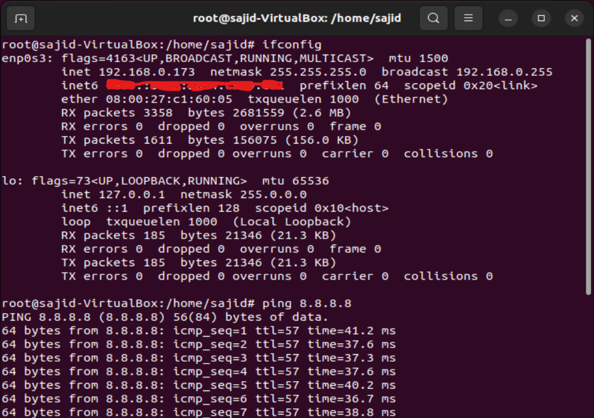
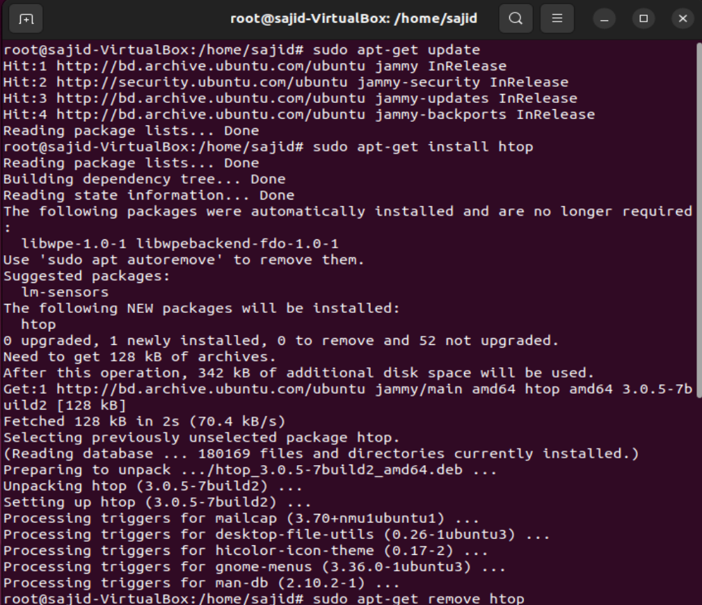
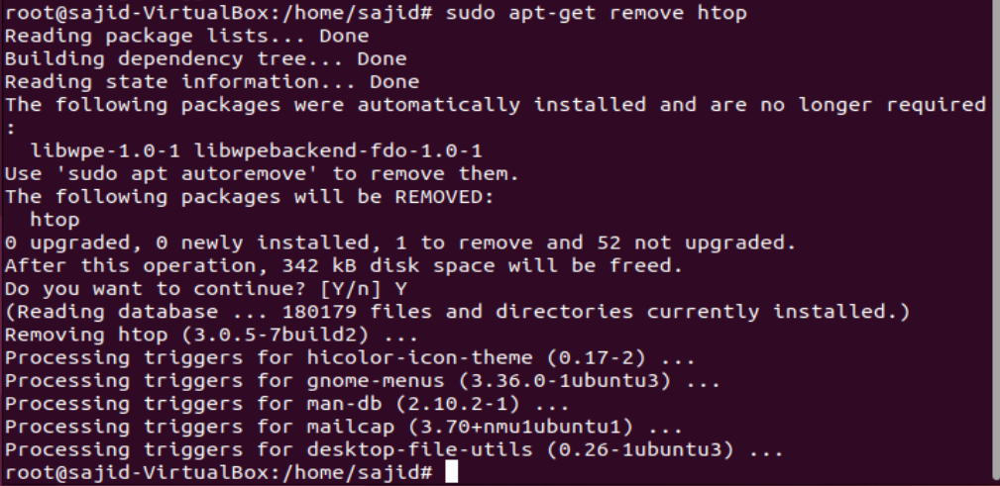

### Task: Linux Fundamentals Practice

### Exercise 1: File System Navigation and File Management

1. Navigate to the `/var/log` directory.
   ```
    sudo su
    cd /var/log
   ```
2. List all files and directories in the `/var/log` directory.
    ```
    ls
    ```
3. Create a new directory named `test_logs` within `/var/log`.
   ```
   mkdir test_logs
   ```
4. Navigate into the `test_logs` directory.
   ```
   cd test_logs
   ```
5. Create an empty file named `test.log`.
   ```
   touch test.log
   ```
6. Display the contents of the `test.log` file.
   ```
   cat test.log
   ```
7. Edit the `test.log` file and add a new line of text.
   ```
   nano test.log
   ```
8. Save and exit the text editor.
    > `ctrl + x` then `Y`

9. Screenshot:
    

### Exercise 2: Process Management
1. Display a list of currently running processes.
   ```
   ps
   ```
2. Identify the PID of the process named `nginx` (assuming it's installed and running).
   ```
   pgrep nginx
   ```
3. Terminate the `nginx` process using its PID.
   ```
   kill 3716 3717 3718 3719 3720
   ```
4. Start the `nginx` process again.
   ```
   systemctl start nginx
   ```
Screenshot:


### Exercise 3: Networking
1. Check the network configuration of your system.
   ```
   ifconfig
   ```
2. Test the connectivity to a remote server by pinging its IP address.
   ```
   ping 8.8.8.8
   ```

Screenshot:


### Exercise 4: Package Management
1. Update the package lists on your system.
   ```
   sudo apt-get update
   ```
2. Install the `htop` package using the appropriate package manager for your Linux distribution.
    ```
    sudo apt-get htop
    ```
3. Remove the `htop` package from your system.
    ```
    sudo apt-get remove htop
    ```

Screenshots:

